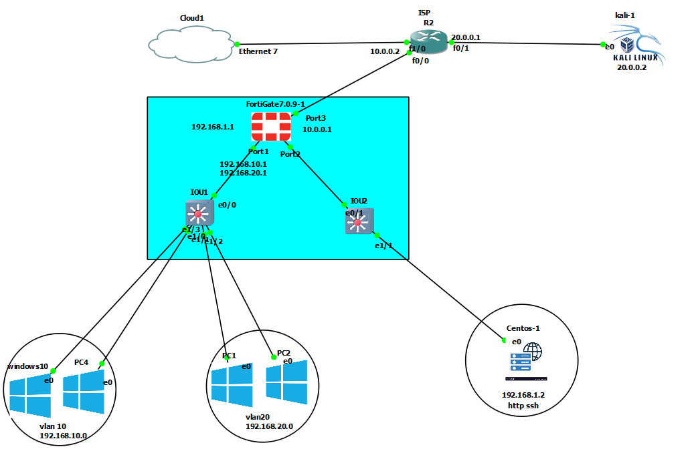
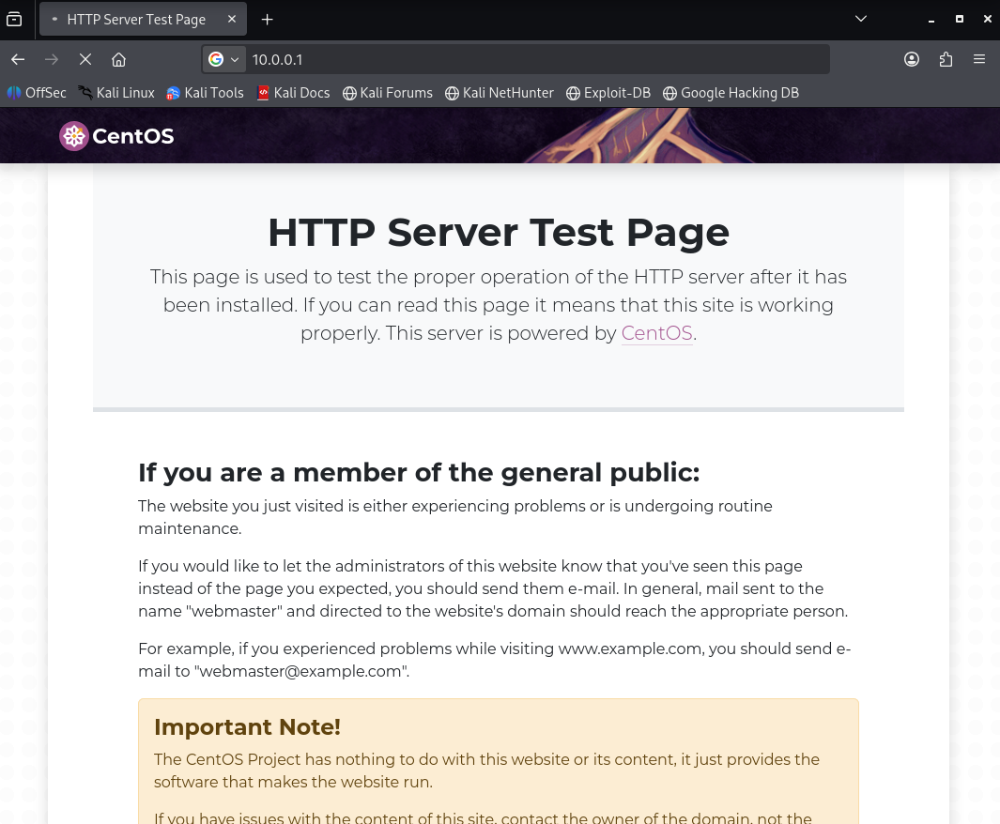

#  Network Security Project

##  Description
This project is a **Network Security Lab** built using **GNS3** and a **FortiGate Firewall**.  
It simulates a secure enterprise network with segmentation between **LAN, DMZ, and Internet**, including advanced security features such as **NAT, VIP, VPN, and DoS protection**.

---

##  Objective
To simulate a secure enterprise network with controlled access between:
- Internal LAN (VLANs)
- DMZ (public services)
- External network (Internet)

---

##  Network Architecture



### 🔹 Zones:
- **LAN**
  - VLAN10 → 192.168.10.0/24
  - VLAN20 → 192.168.20.0/24
- **DMZ**
  - 192.168.1.0/24 (Web Server)
- **WAN**
  - 10.0.0.0/24
- **External (Kali)**
  - 20.0.0.0/24

---

##  Technologies Used

- GNS3
- FortiGate Firewall (v7.0.9)
- Cisco IOU Switch (VLANs)
- CentOS Web Server (Apache HTTP/HTTPS)
- Kali Linux (Attacker / Testing)
- NAT (FortiGate + ISP Router)

---

##  Security Features

### 🔸 NAT
- Configured on:
  - FortiGate (LAN → WAN)
  - ISP Router (Internet simulation)

---

### 🔸 VIP (Port Forwarding)

Used to expose the web server in the DMZ:

```bash
config firewall vip
    edit "web-vip"
        set extip 10.0.0.1
        set mappedip "192.168.1.2"
        set portforward enable
        set extport 80
        set mappedport 80
    next
````

---

### 🔸 Firewall Policies

* VLAN ↔ VLAN communication
* LAN → DMZ allowed
* LAN → Internet with NAT
* WAN → DMZ only HTTP/HTTPS (via VIP)
* VPN access to LAN & DMZ

---

### 🔸 DoS Protection

Protection applied on WAN interface:

* SYN Flood protection
* UDP Flood protection
* ICMP Flood protection
* Port scan detection

Example:

```bash
set action block
set threshold 500
```

---

### 🔸 VLAN Segmentation

| VLAN   | Network         | Description    |
| ------ | --------------- | -------------- |
| VLAN10 | 192.168.10.0/24 | Internal users |
| VLAN20 | 192.168.20.0/24 | Internal users |

---

### 🔸 SSL VPN

* Remote users connect via FortiGate SSL VPN
* Access to:

  * VLAN10
  * VLAN20
  * DMZ

---

##  Services

### 🔹 Web Server (CentOS)

* IP: `192.168.1.2`
* Services:

  * HTTP (80)
  * HTTPS (443)



---

##  Tests & Validation

✔ External access to web server via public IP
✔ LAN access to DMZ
✔ VLAN communication working
✔ DoS attack mitigation tested using Kali (hping3)
✔ VPN access to internal resources

---

##  Project Structure

```
network-security-project/
├── README.md
├── configs/
│   ├── fortigate-vip.conf        # FortiGate VIP configuration
│   ├── fortigate-policy.conf     # FortiGate firewall policies
│   └── httpd-ssl.conf            # Apache SSL virtual host config
├── scripts/
│   ├── generate-cert.sh          # SSL certificate generation script
│   └── setup-httpd-ssl.sh        # Apache HTTPS setup script
└── diagrams/
    └── network-diagram.md        # Network topology description
```

---

##  How to Run

1. Open project in **GNS3**
2. Start all devices:

   * FortiGate
   * Routers
   * Switches
   * Servers
3. Configure IP addresses
4. Test:

   * HTTP access from WAN
   * VPN connection
   * DoS protection

---

##  Security Notes

* Private keys are excluded using `.gitignore`
* Only HTTP/HTTPS allowed from WAN
* LAN is protected from direct external access

---

##  Author

* Mouaad

---

## 📌 Conclusion

This project demonstrates how to design and implement a **secure network architecture** using:

* Segmentation (VLAN + DMZ)
* Firewall policies
* NAT & VIP
* VPN access
* DoS protection

